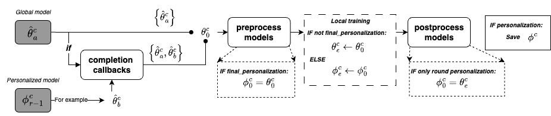

# A basic platform for Personalized Federated Learning

`pflbases`, built upon the Plato framework, is designed as a basic platform for personalized federated learning (FL) and, thus, can be used to implement various personalized FL algorithms while testing them with <ins>fairness</ins> and <ins>reproducibility</ins> guarantees. 

As personalized federated learning is one specific domain of federated learning (FL),  its learning process should always focus on the process of how to exchange the global model between clients and the server and how to train this model during the federated training paradigm. Subsequently, the second priority can be to use the global model as the intermediary toward training high-quality personalized models. 

Hence, the core design principle underlying `pflbases` is to prioritize learning the global model (`self.model`), relegating all other models (`self.personalized_model`) or operations to subsidiary roles or auxiliary procedures. Besides, the global model and personalized models are treated as two separate models.

With this principle, `pflbases` will always execute Plato's functions or programs of training the global model and only perform personalization with the corresponding configs after the final round of training. (See Core Structure for more code details.)


## Two Basic Learning Modes

`pflbases` contains two basic learning modes, i.e., performing personalization in each round or the next round of the final round. The indicator is `do_personalization_per_round` (see hyper-parameters below).

When `do_personalization_per_round: true`, the personalized model will be 1. Loaded; 2. Obtained; 3. Tested; 4. Saved, in each round. Otherwise, the personalized model will only be processed in the next round of the final round. 

We believe that these two modes can cover all personalized FL algorithms. For example, 
- APFL, Ditto, LG-FedAvg, FedPer, FedRep, and FedBABU follows `do_personalization_per_round: true`. 
- FedAvg with finetuning (fedavg_finetune) and PerFeAvg follows `do_personalization_per_round: false`.


## Core Functions

Illustration of the core pipeline of the structure of`pflbases` is shown below.



In response to the abovementioned principle and learning modes, `pflbases` will always execute the code to 1). load the configuration within `trainer` block; 2). execute the Plato's code to operate on `self.model`, 3). train the `self.model` before reaching the total rounds (i.e., before the final personalization). Even though one set `do_personalization_per_round: true`, __no specific code towards training personalized models will be executed__. 

To make `pflbases` general enough as a personalized FL platform, two code parts in the structure should be emphasized. Thus, the user can simply adjust them to implement a customized algorithm. 

- the _completion_ callbacks placed under `client_callbacks` merge other models into the `self.model` parameters. 
    > For example, when the whole model is A+B, you can set the global model to be A while the personalized model is B. To train the personalized model, you need to merge B to A as the `self.model` to be trained subsequently. 

- `preprocess_models()` and `postprocess_models` typically need to be adjusted to achieve a customized way to train personalized models. 

    - The default operation of `preprocess_models()` is to copy the `self.model` to the `self.personalized_model` only in the final personalization.
        >FedAvg-finetune uses this default logic as the personalized models are only trained in the final personalization, thus requiring assigning the received global model to the personalized model for the subsequent personalized training.  

    - The default operation of `postprocess_models()` is to copy the `self.model` to the `self.personalized_model` only when `do_personalization_per_round: true` and not the final personalization.

        >FedRep uses this default logic. It merges the `self.personalized_model` into `self.model` as submodules with _completion_. Thus, after training `self.model`, the trained submodules should be copied back to the `self.personalized_model`, __equivalent to training the personalized model__. 


--- 

## Implemented Algorithms

To better compare the performance of different personalized federated learning approaches, we implemented the following algorithms using the `pflbases` framework. The code is available under `algorithms/`.

### Baseline Algorithm

We implemented the FedAvg with finetuning, referred to as FedAvg_finetune, as the baseline algorithm for personalized federated learning (FL). The code is available under `algorithms/fedavg_finetune/`.


### Classical personalized FL approaches

- {apfl} [Deng et al., "Adaptive Personalized Federated Learning", Arxiv 2020, citation 374](https://arxiv.org/pdf/2003.13461.pdf) - None

- {fedper} [Arivazhagan et al., "Federated Learning with Personalization Layers", Arxiv 2019, citation 486](https://browse.arxiv.org/pdf/1912.00818.pdf) - [Third-part Code](https://github.com/ki-ljl/FedPer)

- {ditto} [Li et.al "Ditto: Fair and robust federated learning through personalization", ICML2020, citation 419](https://proceedings.mlr.press/v139/li21h.html) - [Office code](https://github.com/litian96/ditto)

- {fedbabu} [Oh et.al "FedBABU: Toward Enhanced Representation for Federated Image Classification", ICLR 2022, citation 74](https://openreview.net/pdf?id=HuaYQfggn5u) - [Office code](https://github.com/jhoon-oh/FedBABU)

- {fedrep} [Collins et al., "Exploiting Shared Representations for Personalized Federated
Learning", ICML21, citation 289](https://arxiv.org/abs/2102.07078) - [Office code](https://github.com/lgcollins/FedRep)

- {lgfedavg} [Liang et al., "Think Locally, Act Globally: Federated Learning with Local and Global Representations", NeurIPS 2019, citation 359](https://arxiv.org/abs/2001.01523) - [Office code](https://github.com/pliang279/LG-FedAvg)

- {perfedavg} [Fallah et al., "Personalized federated learning with theoretical guarantees:
A model-agnostic meta-learning approach", NeurIPS 2019, citation 502](https://proceedings.neurips.cc/paper/2020/hash/24389bfe4fe2eba8bf9aa9203a44cdad-Abstract.html) - [Third-part code](https://github.com/jhoon-oh/FedBABU)

- {hermes} [Li et al., "Hermes: An Efficient Federated Learning Framework for Heterogeneous Mobile Clients", ACM MobiCom 21, citation 75](https://www.ang-li.com/assets/pdf/hermes.pdf) - None (The algorithm, first developed by Ying Chen, has been refined to integrate with the `pflbases` framework.)

### Personalized FL approaches with self-supervised learning

In the context of self-supervised learning (SSL), the model is trained to learn representations from unlabeled data. Thus, the model is capable of extracting generic representations. A higher performance can be achieved in subsequent tasks with the trained model as the encoder. Such a benefit of SSL is introduced into personalized FL by relying on the learning objective of SSL to train the global model. After reaching convergence, each client can download the trained global model to extract features from local samples. A high-quality personalized model, typically a linear network, is prone to be achieved under those extracted features. The code is available under `SSL/`.

- {SimCLR} [Chen et al., "A Simple Framework for Contrastive Learning of Visual Representations", Arxiv 2020, citation 374](https://arxiv.org/abs/2002.05709) - [Office code](https://github.com/google-research/simclr)


## Algorithms Running

1. Go to the folder `examples/personalized_fl`.
2. Install pflbases by running 

```bash
pip install .
```

3. Perfrom the algorithms by running:

```bash
python algorithms/fedavg_finetune/fedavg_finetune.py -c algorithms/configs/fedavg_finetune_CIFAR10_resnet18.yml -b pflExperiments
```

---

```bash
python algorithms/apfl/apfl.py -c algorithms/configs/apfl_CIFAR10_resnet18.yml -b pflExperiments
```

```bash
python algorithms/fedrep/fedrep.py -c algorithms/configs/fedrep_CIFAR10_resnet18.yml -b pflExperiments
```

```bash
python algorithms/fedbabu/fedbabu.py -c algorithms/configs/fedbabu_CIFAR10_resnet18.yml -b pflExperiments
```

```bash
python algorithms/ditto/ditto.py -c algorithms/configs/ditto_CIFAR10_resnet18.yml -b pflExperiments
```

```bash
python algorithms/fedper/fedper.py -c algorithms/configs/fedper_CIFAR10_resnet18.yml -b pflExperiments
```

```bash
python algorithms/lgfedavg/lgfedavg.py -c algorithms/configs/lgfedavg_CIFAR10_resnet18.yml -b pflExperiments
```

```bash
python algorithms/perfedavg/perfedavg.py -c algorithms/configs/perfedavg_CIFAR10_resnet18.yml -b pflExperiments
```

```bash
python algorithms/hermes/hermes.py -c algorithms/configs/hermes_CIFAR10_resnet18.yml -b pflExperiments
```

---

```bash
python algorithms/SSL/simclr/simclr.py -c algorithms/configs/SSL/simclr_CIFAR10_resnet18.yml -b pflExperiments
```

```bash
python algorithms/SSL/simsiam/simsiam.py -c algorithms/configs/SSL/simsiam_CIFAR10_resnet18.yml -b pflExperiments
```

```bash
python algorithms/SSL/smog/smog.py -c algorithms/configs/SSL/smog_CIFAR10_resnet18.yml -b pflExperiments
```

```bash
python algorithms/SSL/swav/swav.py -c algorithms/configs/SSL/swav_CIFAR10_resnet18.yml -b pflExperiments
```

This mocov2 may have some problems because the loss is not decreasing.
```bash
python algorithms/SSL/moco/mocov2.py -c algorithms/configs/SSL/mocov2_CIFAR10_resnet18.yml -b pflExperiments
```

```bash
python algorithms/SSL/byol/byol.py -c algorithms/configs/SSL/byol_CIFAR10_resnet18.yml -b pflExperiments
```


```bash
python algorithms/SSL/calibre/calibre.py -c algorithms/configs/SSL/calibre_CIFAR10_resnet18.yml -b pflExperiments
```


## Hyper-parameters

All hyper-parameters of `pflbases` should be placed under the `algorithm` block of the configuration file. 

### For `fedavg_partial`
- global_modules_name: This is a list in which each item is a string presenting the parameter name. When you utilize the `fedavg_partial.py` as the algorithm, the `global_modules_name` is required to be set under the `algorithm` block of the configuration file. Then, only the parameters contained in the `global_modules_name` will be the global model to be exchanged between the server and clients. Thus, server aggregation will be performed only on these parameters. If this hyper-parameter is not set, all parameters of the defined model will be used by default. For example, 
    ```yaml
    algorithm:
        global_modules_name:
            - conv1
            - bn1
            - layer1
            - layer2
            - layer3
            - layer4
    ```

- completion_modules_name: This is a list in which each item is a string presenting the parameter name. Once you set the `global_modules_name`, the client receives a portion of the model from the server. To embrace all parameters (i.e., the whole model) during the local update, you should set `completion_modules_name` to indicate which parts parameters will be loaded from the local side to merge with the received ones. This is more like: the whole model is A+B. The client receives A from the server. Then, the client loads B from the local side to merge with A. For example, 
    ```yaml
    algorithm:
        completion_modules_name:
            - linear
    ```

### For Personalization

All hyper-parameters related to personalization should be placed under the `personalization` sub-block of the `algorithm` block. 

- model_name: A string to indicate the personalized model name. This is not mandatory as if it is omitted, it will be assumed to be the same as the global model. Default: `model_name` under the `trainer` block.  For example, 
    ```yaml
    algorithm:
        personalization:
            # the personalized model name
            # this can be omitted
            model_name: resnet_18
    ```

- participating_clients_ratio: A float to show the proporation of clients participating in the federated training process. The value ranges from 0.0 to 1.0 while 1.0 means that all clients will participant in training. Default: 1.0. For example, 
    ```yaml
    algorithm:
        personalization:
            # the ratio of clients participanting in training
            participating_clients_ratio: 0.6
    ```

- do_personalization_per_round: A boolean to indicate whether to perform personalization per round. Default: True. For example, 
    ```yaml
    algorithm:
        personalization:

            # whether the personalized model will be
            # obtained in each round
            do_personalization_per_round: true
    ```


## Precautions

As `pflbases` heavily relies on the mechanism that allows each client to load the personalized model from the disk, it is important to ensure that the model loading is correct. Thus, to avoid the program loading personalized models under `checkpoints\` saved by different runnings in experiments, `pflbases` forces the user to delete the `checkpoints/` before each running,; there will be an error presenting as 

```
File "pflbases/personalized_trainer.py", line 426, in load_personalized_model
    self.personalized_model.load_state_dict(
AttributeError: 'NoneType' object has no attribute 'load_state_dict'
```
This is caused by the fact that the program will not define the personalized model once there are saved models under `checkpoints/`.